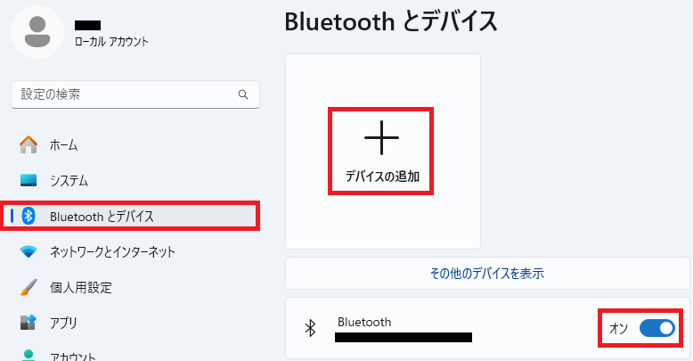
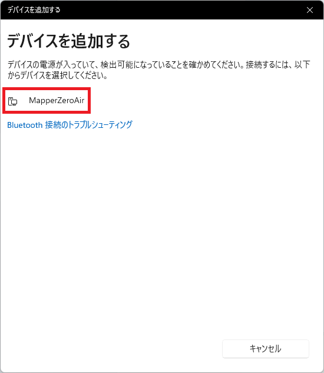
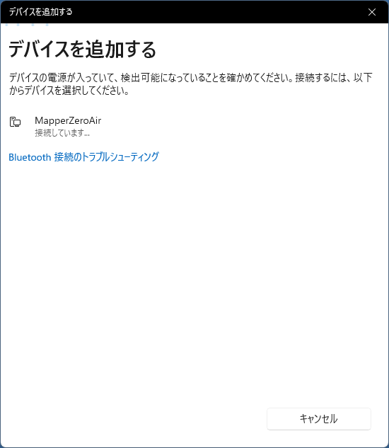
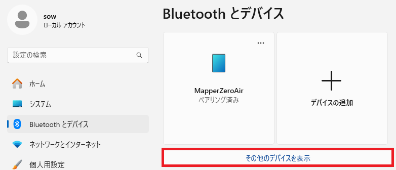
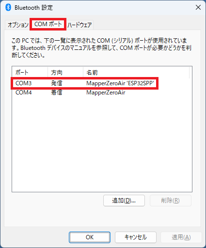
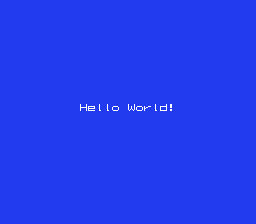
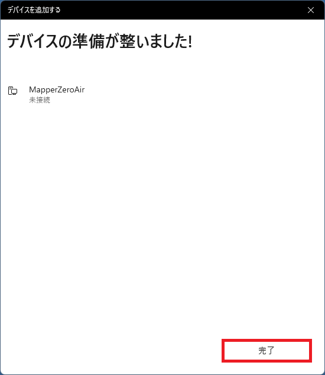

<!-- $Id: README.md 2046 2025-05-02 07:02:21Z sow $ -->
# 無線ダウンロード実行カセット MappserZeroAir

MapperZeroAir は、「ファミコン実機で自作プログラムをダウンロード実行」する操作を爆速で回すためのHW/SWです。

# 1. 概要

## 1-1. 痛み

ファミコン向けにプログラムを書いてエミュレータで動作確認できていても、いざファミコン実機で試すと思ったように動かないことはありませんか？実機でデバッグしようとするとめちゃくちゃTATが悪いと感じることはありませんか？

## 1-2. 解決方法

ファミコンからカセットを抜かずに無線でプログラムをダウンロードして完了したら自動的にリセットがかかるようにしました。  
ついでに、無線でV/Hミラーも指定でき、デバッグ用にLEDが付いていて、printデバッグもできて欲しい、のでそうする事にしました。

![(*) --> ソースコード修正
ソースコード修正 --> nesファイル生成
nesファイル生成 --> [従来] ファミコン本体の電源を落とす
ファミコン本体の電源を落とす --> ファミコン本体からロムカートリッジを取り外し
ファミコン本体からロムカートリッジを取り外し --> ロムカートリッジにバイナリ焼き込み
ロムカートリッジにバイナリ焼き込み --> ロムカートリッジをファミコン本体に差し込み直し
ロムカートリッジをファミコン本体に差し込み直し --> ファミコン本体の電源を入れる
ファミコン本体の電源を入れる --> カートリッジ接触不良対応
カートリッジ接触不良対応 --> テスト
テスト --> (*)
nesファイル生成 --> [提案] MapperZeroAir.exe実行
MapperZeroAir.exe実行 --> テスト](http://www.plantuml.com/plantuml/png/fLDDJi906DtFARfK4po2YGVm0XeMBhfmemGtRkSRDVo0DA0O0mQ9e4QaB30H5EXXNcTQR-4u9IxKOYERvilxtlU-zpepAskhLYgrOO6c41FG63JyB4JUzrpLlsLn3JErRnz2N83Qe0v4BpXlgPp3VaKDVqVEQkgwcxRcVT4ogaFLVFAdDN3tlV6cNXrGDNIcu0_WLomvrQo8eHT1UOW-n0sePtBa81uX16YaDMIb3Yh8JXtyaYql4Jc9utADEERV53GO74_0o-5CVptsZvd5kwWQawOdNrpjDD886iyc-F8gKVQ_prUUT44bK94bfnhbd-xKMJUyl_D7vJ0_a8EPz9ei2MdkynGqraJsLHbSFuj5rrXL7DNEfQsjtKp6pcxRsOFDlUowVMHBjnMsIom6_xRo0m00)

## 1-3. 特徴

- ファミコン本体の改造不要、ホストWindowsも専用ドライバのインストール不要で使えます
- ホストPCから無線越しにNESファイル(PRG-ROM最大32kバイト、CHR-ROM最大8kバイト)をダウンロード可能です
- NESファイルのヘッダに記載されているVミラー/Hミラーの設定をカセットに反映します
- カセットから本体へ送るIRQ割り込み信号を無線越しに生成可能です
- カセットに実装されたデバッグ用のLEDをファミコン用のプログラムから制御可能です
- ファミコンからI/O操作によりホストPCへデータを送信可能です

## 1-4. 構成

ハードウェア(HW)は無線機能付きマイコンの載ったファミコンカセットです。ソフトウェア(SW)はWindows向けのexeファイルを作成しました。両者の間は Bluetooth の COMポート を介して無線でやり取りします。

# 2. 使い方

この章では、MapperZeroAirが手元に届いてから利用開始する前での手順を示します。
※ここでは、Windows 11 HOME 24H2 の場合の接続方法です。OSのエディションやバージョンの違いで見た目や手順が多少異なる場合があります。

## 2-1. HWセットアップ

MapperZeroAirをファミコン本体に挿し、ファミコン本体に電源を入れます。

## 2-2. BluetoothでホストPCとMapperZeroAirを接続

ファミコン本体に挿したMapperZeroAirとホストPCとをBluetoothで接続します。

0. Windowsキーを押下し、設定を開きます。

1. 「Bluetooth とデバイス」を選択し、「Bluetooth」を「オン」にしてから「＋デバイスの追加」を押下します。



2. 「追加するデバイスの種類」に「Bluetooth」を選択してください。


3. しばらくすると現れる「MapperZeroAir」を選択してください。



4. 「接続しています...」となりますが、接続完了を待ってください。



5. 右下のボタンが「完了」になったら「完了」を押下してください。


## 2-3. COMポートの確認

ホストPCからMapperZeroAirに接続するためのCOMポートを確認します。

6. 「Bluetooth とデバイス」の「その他のデバイスを表示」を押下します。



7. 下までスクロールして「その他の Bluetooth 設定」を開きます


8. タブ「COMポート」を開き、名前が「MapperZeroAir 'ESP32SPP'」なポートを控えます。(下の例では「COM3」を控えることになります)



## 2-4. Hello World! のダウンロード

9. https://github.com/isariyokurari/MapperZeroAir/archive/refs/heads/main.zip をダウンロードして展開してください。※以降の例では「C:\MapperZeroAir-main」に展開されたものとして説明を続けます。

10. コマンドプロンプトを開き(Windowsキーを押下し、「cmd」と入力してEnterキーを押す)、展開したディレクトリへ移動してください。(例：「cd C:\MapperZeroAir-main」を実行する)

11. 先に控えたCOMポートを使い、「exe\MapperZeroAir.exe <COMポート> nes\prg0000_HelloWorld.nes」を実行してください。(例：「exe\MapperZeroAir.exe COM3 nes\prg0000_HelloWorld.nes」)

12. 「Successed to write from 0x8000 to 0xFFFF.」と表示されたらダウンロード完了です。ファミコン本体のリセットボタンを押し、「Hello World!」と表示されることを確認してください。



## 2-5. 実行例

下に実行例の動画を示します。

<iframe width="560" height="315" src="https://www.youtube.com/embed/zyV-2UMJdmg?si=1XybDUEhwA2YNlFr" title="YouTube video player" frameborder="0" allow="accelerometer; autoplay; clipboard-write; encrypted-media; gyroscope; picture-in-picture; web-share" referrerpolicy="strict-origin-when-cross-origin" allowfullscreen></iframe>

# 3. 公開

基本情報、回路図(schema)、ソースコード(exe、arduino)、設計、テスト、サンプルプログラム(asm) を公開していきます。

## 3-1. ディレクトリ構成

```
MapperZeroAir
│　LICENSE
│　README.md
│
├─schema
│　　　MapperZeroAir.pdf
│
├─exe
│　　　Makefile
│　　　MapperZeroAir.c
│　　　MapperZeroAir.exe
│
├─arduino
│　└─MapperZeroAir
│　　　　　MapperZeroAir.h
│　　　　　MapperZeroAir.ino
│
└─asm
　　└─prg0000_HelloWorld
　　　　　　prg0000_HelloWorld.asm
```

## 3-2. 開発環境(動作確認環境)

- Windows10 HOME 64bit 22H2 / Windows 11 HOME 24H2
- Arduino IDE 2.2.1
- esp32 by Espressif System 2.0.11
- gcc version 4.8.1 (GCC) for mingw32

## 3-3. 設計

## 3-4. テスト

## 3-5. サンプルプログラム

## 3-6. フォント

公開アセンブラコードでは、下記自作フォントを使用しています。  


# 4. Q&A

Q. 「デバイスの準備が整いました!」となっても「MapperZeroAir」が「未接続」になる
A. 「接続済み」となった後、すぐに「未接続」となりますが、「完了」を押していただければ問題ありません。



# 5. 引用商標

- ファミコンは、日本またはその他地域における任天堂株式会社の登録商標です。  
- Windowsは、米国またはその他地域におけるMicrosoft社の登録商標です。
- Arduinoは、日本国内においてArduino SRLの商標登録です。
- ESP32は、Espressif Systems (Shanghai) Co., Ltd.の中国または他の国における商標登録または商標です。
