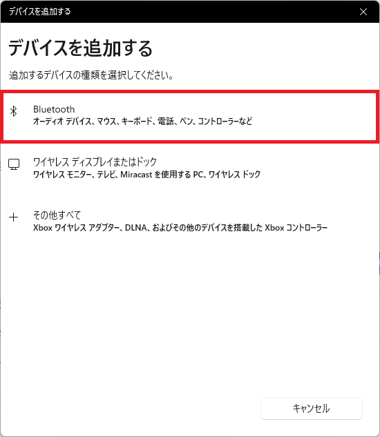
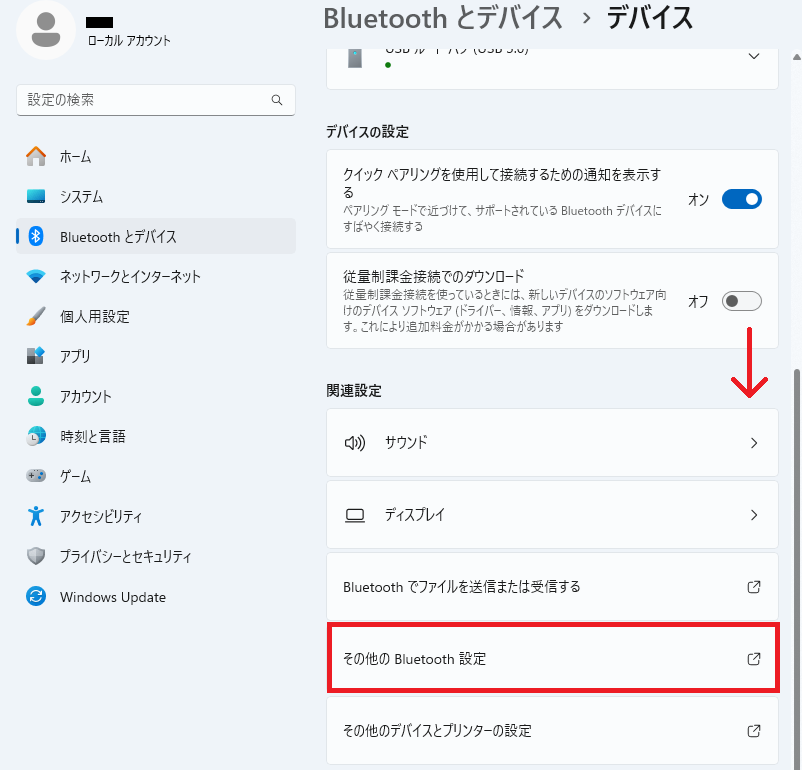

<!-- $Id: README.md 2054 2025-05-02 13:04:26Z sow $ -->
# 無線ダウンロード実行カセット MappserZeroAir

MapperZeroAir は、「ファミコン実機で自作プログラムをダウンロード実行」する操作を爆速で回すためのファミコンカセットです。


# 1. 概要

## 1-1. 痛み

ファミコン向けにプログラムを書いてエミュレータで動作確認できていても、いざファミコン実機で試すと思ったように動かない。実機でデバッグしようとするとファミコンの電源切ってカセット抜いてROM焼き直してカセット挿し直して電源入れて...とめちゃくちゃTATが悪い。もっと効率よく小さいプログラムの塊をデバッグできるようにならないものか。

## 1-2. 解決方法

ファミコンからカセットを抜かずに無線でプログラムをダウンロードして完了したら自動的にリセットがかかるようにしました。
ついでに、無線でV/Hミラーも指定でき、デバッグ用にLEDが付いていて、printデバッグもできて欲しい、のでそうする事にしました。

![(*) --> ソースコード修正
ソースコード修正 --> nesファイル生成
nesファイル生成 --> [従来] ファミコン本体の電源を落とす
ファミコン本体の電源を落とす --> ファミコン本体からロムカートリッジを取り外し
ファミコン本体からロムカートリッジを取り外し --> ロムカートリッジにバイナリ焼き込み
ロムカートリッジにバイナリ焼き込み --> ロムカートリッジをファミコン本体に差し込み直し
ロムカートリッジをファミコン本体に差し込み直し --> ファミコン本体の電源を入れる
ファミコン本体の電源を入れる --> カートリッジ接触不良対応
カートリッジ接触不良対応 --> テスト
テスト --> (*)
nesファイル生成 --> [提案] MapperZeroAir.exe実行
MapperZeroAir.exe実行 --> テスト](http://www.plantuml.com/plantuml/png/fLDDJi906DtFARfK4po2YGVm0XeMBhfmemGtRkSRDVo0DA0O0mQ9e4QaB30H5EXXNcTQR-4u9IxKOYERvilxtlU-zpepAskhLYgrOO6c41FG63JyB4JUzrpLlsLn3JErRnz2N83Qe0v4BpXlgPp3VaKDVqVEQkgwcxRcVT4ogaFLVFAdDN3tlV6cNXrGDNIcu0_WLomvrQo8eHT1UOW-n0sePtBa81uX16YaDMIb3Yh8JXtyaYql4Jc9utADEERV53GO74_0o-5CVptsZvd5kwWQawOdNrpjDD886iyc-F8gKVQ_prUUT44bK94bfnhbd-xKMJUyl_D7vJ0_a8EPz9ei2MdkynGqraJsLHbSFuj5rrXL7DNEfQsjtKp6pcxRsOFDlUowVMHBjnMsIom6_xRo0m00)

## 1-3. 特徴

- ファミコン本体の改造不要、ホストWindowsも専用ドライバのインストール不要で使えます
- ホストPCから無線越しにNESファイル(PRG-ROM最大32kバイト、CHR-ROM最大8kバイト)をダウンロード可能です
- NESファイルのヘッダに記載されているVミラー/Hミラーの設定をカセットに反映します
- カセットから本体へ送るIRQ割り込み信号を無線越しに生成可能です
- カセットに実装されたデバッグ用のLEDをファミコン用のプログラムから制御可能です
- ファミコンからI/O操作によりホストPCへデータを送信可能です

## 1-4. 構成

ハードウェア(HW)は無線機能付きマイコンの載ったファミコンカセットです。ソフトウェア(SW)はWindows向けのexeファイルを作成しました。両者の間は Bluetooth の COMポート を介して無線でやり取りします。

# 2. 使い始めるまで

この章では、MapperZeroAirが手元に届いてから利用開始する前での手順を示します。<br>
※ここでは、Windows 11 HOME 24H2 の場合の接続方法です。OSのエディションやバージョンの違いで見た目や手順が多少異なる場合があります。

## 2-1. HWセットアップ

MapperZeroAirをファミコン本体に挿し、ファミコン本体に電源を入れます。

## 2-2. BluetoothでホストPCとMapperZeroAirを接続

ファミコン本体に挿したMapperZeroAirとホストPCとをBluetoothで接続します。

0. Windowsキーを押下し、設定を開きます。

1. 「Bluetooth とデバイス」を選択し、「Bluetooth」を「オン」にしてから「＋デバイスの追加」を押下します。


2. 「追加するデバイスの種類」に「Bluetooth」を選択してください。



3. しばらくすると現れる「MapperZeroAir」を選択してください。


4. 「接続しています...」となりますが、接続完了を待ってください。


5. 右下のボタンが「完了」になったら「完了」を押下してください。


## 2-3. COMポートの確認

ホストPCからMapperZeroAirに接続するためのCOMポートを確認します。

6. 「Bluetooth とデバイス」の「その他のデバイスを表示」を押下します。


7. 下までスクロールして「その他の Bluetooth 設定」を開きます



8. タブ「COMポート」を開き、名前が「MapperZeroAir 'ESP32SPP'」なポートを控えます。(下の例では「COM3」を控えることになります)


## 2-4. Hello World! のダウンロード実行

9. https://github.com/isariyokurari/MapperZeroAir/archive/refs/heads/main.zip をダウンロードして展開してください。※以降の例では「C:\MapperZeroAir-main」に展開されたものとして説明を続けます。

10. コマンドプロンプトを開き(Windowsキーを押下し、「cmd」と入力してEnterキーを押す)、展開したディレクトリへ移動してください。(例：「cd C:\MapperZeroAir-main」を実行する)

11. 先に控えたCOMポートを使い、「exe\MapperZeroAir.exe <COMポート> nes\prg0000_HelloWorld.nes」を実行してください。(例：「exe\MapperZeroAir.exe COM3 nes\prg0000_HelloWorld.nes」)

12. 「Successed to write from 0x8000 to 0xFFFF.」と表示されたらダウンロード完了です。ファミコン本体のリセットボタンを押し、「Hello World!」と表示されることを確認してください。


実行した様子を収めた動画は下から閲覧できます。

https://youtu.be/zyV-2UMJdmg<br>
[](https://www.youtube.com/watch?v=zyV-2UMJdmg)

# 3. 使い方

## 3-1. MapperZeroAir.exe の使い方

### ダウンロード実行

MapperZeroAirにプログラムをダウンロードするモードです。「--irq」オプションは、プログラムのダウンロードの前にIRQ割り込みを発生させるオプションです。

```
Usage : MapperZeroAir.exe <COMn> <FILE> [--irq]
```

対応しているマッパーは マッパー#0 と マッパー#2(CHR-ROMが0kバイト) です。PRG-ROMは16kバイトか32kバイト、CHR-ROMは0kバイトか8kバイトに対応しています。マッパー#0のダウンロードは、最初にCHR-ROMローダをダウンロード実行した後、PRG-ROMをダウンロードします。この時、CHR-ROMローダのダウンロード後とPRG-ROMのダウンロード後にリセット操作の指示が出るので従ってください。マッパー#2をダウンロードする場合、CHR-ROMローダのダウンロード実行はありません。マッパー#2 且つ「--irq」オプション指定し、後述する「IRQをトリガとしたリセット」を実装すると、ファミコン本体の操作なしにダウンロード後にリセットベクタへ飛ばすことができます。16kバイトのPRG-ROMのみのマッパー#2をダウンロード実行することでTATよく実機確認を行えます。

参考動画：ファミコンカセットに無線でダウンロードして実行＆自動リセット<br>
https://youtu.be/zyV-2UMJdmg

### モニタ実行

ファミコン用プログラムから送られてくるデータをASCII文字で表示するモードです。

```
Usage: MapperZeroAir.exe <COMn> --spi
```

参考動画：ホストPCでファミコンのコントローラ情報を表示<br>
https://youtu.be/Nj-gnS3i97A

## 3-2. ファミコン用プログラムの書き方

本ドキュメントは、ファミコン用のアセンブラにNESASMを想定しています。アセンブラによるファミコン向けプログラムを作成、修正、エミュレータなどで実行、デバッグできる方を対象として説明します。

### IRQをトリガとしたリセット

サンプル「asm/prg0000_HelloWorld/prg0000_HelloWorld.asm」は、「16kバイトのPRG-ROMのみのマッパー#2」なサンプルプログラムとなっており、「IRQ割り込みをトリガとしたリセット」が実装されています。コード中の FILL_CHR_ROM_EN および USE_IRQ_LOADER を「1」にしておくことで、コード修正後のダウンロード実行を本体に触れずに実行できます。一度 CHR-ROM の内容が転送された後は、FILL_CHR_ROM_EN を「0」にすることで、さらにプログラムの起動を早くすることができます。この仕組みを利用する場合は、FILL_CHR_ROM_EN と記載のある行や USE_IRQ_LOADER と記載のある行を自身のコードに埋め込んでください。シーケンスの詳細は設計情報「ダウンロード実行のシーケンス図」を参考にしてください。

参考動画：ファミコンカセットに無線でダウンロードして実行＆自動リセット<br>
https://youtu.be/zyV-2UMJdmg

### LEDの操作

サンプル「asm/prg0001_BlinkLED/prg0001_BlinkLED.asm」は、LEDを操作するサンプルプログラムです。LEDはCPUアドレスマップの$6000の下位3bitに接続されたラッチの出力の最下位bitに接続されています。1をセットするとLEDが点灯し、0をセットすると消灯します。LEDを制御するラッチの出力は、後述するSPIバスのSCK信号と共有しています。

参考動画：MapperZeroAirを使った「ファミコンでLチカ」<br>
https://youtu.be/3pPrdFvhvLE

### printの操作

サンプル「asm/prg0002_HowToUseSPI/prg0002_HowToUseSPI.asm」は、CPUアドレスマップの$6000の下位3bitに接続されたラッチでSPIバスを操作して、ホストPCにprint出力をするサンプルプログラムです。SPI_OUTPUT_EN を「1」にすると、SPI_BUS_RESET と SPI_SEND_A_BYTE が使えるようになります。SPI_BUS_RESET を実行後、printしたいデータをXレジスタに入れて SPI_SEND_A_BYTE を呼び出すことで、ホストPCに1Byteのデータを送信、print出力することができます。ホストPCは、前述の「モニタ実行」をしておくと、ファミコンからprint出力されたデータをASCII文字で表示することができます。この仕組みを利用する場合は、SPI_OUTPUT_EN と記載のある行を自身のコードに埋め込み、SPI_BUS_RESET を実行後、printしたいデータをXレジスタに入れて SPI_SEND_A_BYTE を呼び出してください。

参考動画：ファミコンからホストPCにデータを送る例<br>
https://youtu.be/u2sw9qeY_OA

サンプル「asm/prg0003_DumpPad1ViaSPI/prg0003_DumpPad1ViaSPI.asm」も、ファミコンからホストPCにデータを送る例です。ファミコンのコントローラの入力状態をホストPCで表示しているため、ファミコンからデータを送っていることが分かりやすいです。文字コード「0x0D」(キャリッジリターン)によりカーソルが行頭に戻され、表示中の0と1が更新されていることが見て取れます。

参考動画：ホストPCでファミコンのコントローラ情報を表示<br>
https://youtu.be/Nj-gnS3i97A

# 4. 公開

基本情報、回路図(schema)、ソースコード(exe、arduino)、設計、テスト、サンプルプログラム(asm) を公開していきます。

## 4-1. ディレクトリ構成

```
MapperZeroAir
│　LICENSE
│　README.md
│
├─schema
│　　　MapperZeroAir.pdf          ... 回路図
│
├─exe
│　　　Makefile
│　　　MapperZeroAir.c            ... ホストPC用実行ファイルのソースコード
│　　　MapperZeroAir.exe          ... ホストPC用実行ファイル
│
├─arduino
│　└─MapperZeroAir
│　　　　　MapperZeroAir.h        ... MapperZeroAir用のヘッダファイル(.cおよび.inoから参照)
│　　　　　MapperZeroAir.ino      ... MapperZeroAirに搭載されたマイコン用のコード
│
├─nes
│　　　prg0000_HelloWorld..nes    ... 動作確認用のnesファイル
│
└─asm
　　└─prg0000_HelloWorld
　　　　　　prg0000_HelloWorld.asm ... サンプルコード(NESASM用)
```

## 4-2. 開発環境(動作確認環境)

- Windows10 HOME 64bit 22H2 / Windows 11 HOME 24H2
- Arduino IDE 2.2.1
- esp32 by Espressif System 2.0.11
- gcc version 4.8.1 (GCC) for mingw32

## 4-3. 設計

### MapperZeroAirのブロック図

### MapperZeroAirのメモリマップ

### ダウンロード実行のシーケンス図

## 4-4. テスト

### MapperZeroAir.exe

exe/Makefile にて、ターゲット「test」でテストが実装されています。

### 出荷前テスト

下に出荷前テストの項目を示します。
- 工事中

## 4-5. サンプルプログラム

asm/prgXXXX_YYYYYYYY にサンプルコードがあります。詳細は、asm/prgXXXX_YYYYYYYY/readme.md を参照してください。

## 4-6. フォント

公開アセンブラコードでは、下記自作フォントを使用しています。


# 5. Q&A

Q. 「デバイスの準備が整いました!」となっても「MapperZeroAir」が「未接続」になる<br>
A. 「接続済み」となった後、すぐに「未接続」となりますが、「完了」を押していただければ問題ありません。


Q. ダウンロード実行がうまくいきません<br>
A. ダウンロード中にファミコンのプログラムが暴走している可能性があります。ファミコン本体のリセットボタンを押した状態でnes/prg0000_HelloWorld.nesをダウンロードしてみてください。

# 6. 販売ページ

以下から MapperZeroAir を購入できます。<br>
https://isariyokurari.booth.pm/items/6864946<br>
※2025年5月1日現在、SRAMが2種類ともOELとなっています。数に限りがございますので早めにお買い求めください。

# 7. 引用商標

- ファミコンは、日本またはその他地域における任天堂株式会社の登録商標です。
- Windowsは、米国またはその他地域におけるMicrosoft社の登録商標です。
- Arduinoは、日本国内においてArduino SRLの商標登録です。
- ESP32は、Espressif Systems (Shanghai) Co., Ltd.の中国または他の国における商標登録または商標です。
